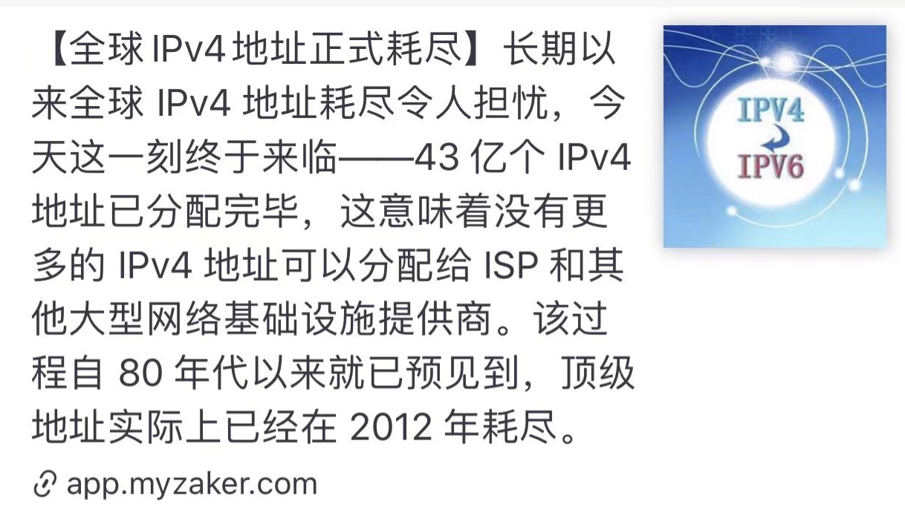
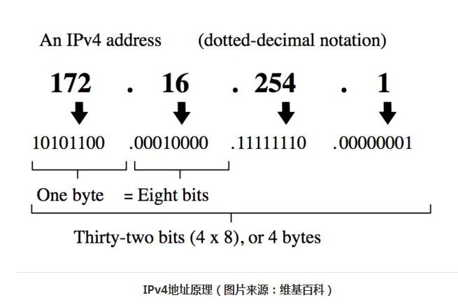

## IPv4 地址耗尽

看到这则新闻，我思考了几个问题：

**(1).为什么 IPv4 会耗尽？**

因为 IPv4 采用 32 位 的十进制数字来表示。
原理：

举个🌰：
`172.165.22.1`
to bit:
`10101100.10100101.00010110.00000001`
因此，上述的所有地址应为最大位数： 2 ** 32 = 4294967296 ≈ 32 亿，显然，在移动设备盛行的今天，必然是不够用的。

**(2).为什么要使用 IPv6 来取代 IPv4 ?**
IPv6 使用 128 位 十六进制数字来表示，常用冒分十六进制表示法：
`2001:0db8:85a3:08d3:1319:8a2e:0370:7344`
能容纳的数的总和为 16 ** 32 = 2 ** 4 ** 32  = 2 ** 128
因此，这个庞大的数字基本可以满足当下互联网发展的 “地址标识符” 不足的现状。

就像 **[轮子哥]** 说的：
[ipv6可以给整个地球的每一个夸克都assign一个地址还能省下很多，走出银河系前毫无压力。](https://www.zhihu.com/question/357832973/answer/912007135)

另外,IPv6 具备另外一些优势，详见 Read More

[Read More](https://zhuanlan.zhihu.com/p/52698761)

<b>😘 觉得文章有用？点击下方打赏，鼓励作者更好的写作！</b>
