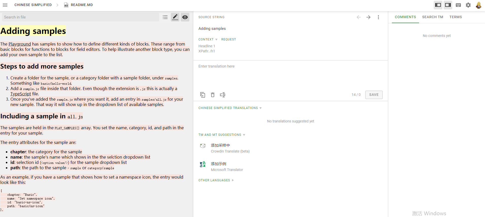
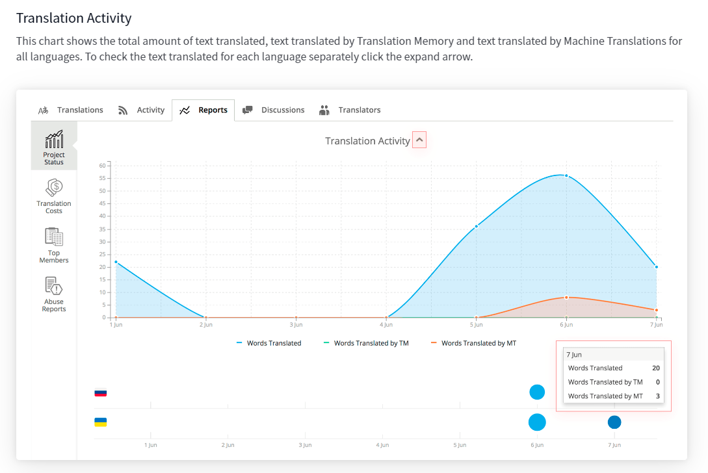

## 开源项目的翻译(i18n)方案

目前，多数的国外开源项目都采用 [crowdin](https://support.crowdin.com/) 来做 i18n 和 i18n 托管的。

根据官方的描述，其本质是一套面向科技公司的、cloud-based + autoML 的翻译方案。由项目的管理者上传项目，再将需要翻译的部分提供给热心的开源市民来翻译；或者是请专业的 translator 来 crowdin 平台翻译，届时通过平台来进行计费工作。

crowdin 也支持项目管理者自行上传 TM (translate memory) 来进行预翻译。

crowdin 集成了 Google translate 以及 MicroSoft translate 这样的老牌机翻引擎会实时提供翻译建议，作为一个 translator 不用担心自己捉襟见肘的词汇量:

还支持 [ICU syntax](http://userguide.icu-project.org/formatparse/messages) 简而言之这套语法就是把需要翻译的例句中，提取出变量，大大简化翻译工作。

最终成果将以 chat 的形式将当前翻译工作的词汇量、进度、预计完成时间、准确度等关键维度的信息陈列给管理者:

[Read More](https://support.crowdin.com/project-reports/)

<b>😘 觉得文章有用？点击下方打赏，鼓励作者更好的写作！</b>