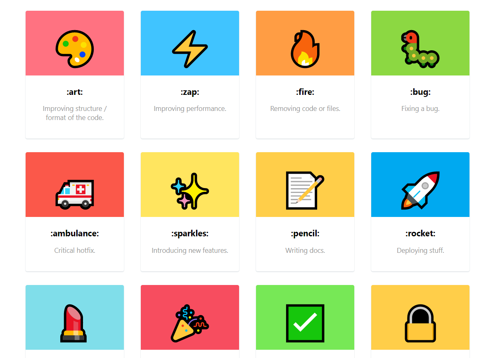

## 更好的语义化提交(commit)

gitmoji 是一个民间常用的 git commit 潮流，每次 commit 使用一个 moji 来让 commit 更加的可读。配合上 semantic commit spec, 会更加规范。

列举一下我常用的:

💄 [lipstick] 样式修改
⚡️ [zap] 性能提升
🔧 [wrench] 配置修改
🐛 [bug] 缺陷修复
📝 [pencil] 文档修复
✨ [sparkles] 新 feature
🚑 [ambulance] 紧急修复
🤖 [robot] CI 构建
♻️ [recycle] 代码重构
🍱 [bento] 静态资源调整

[Read More][https://gitmoji.carloscuesta.me/](https://gitmoji.carloscuesta.me/)
